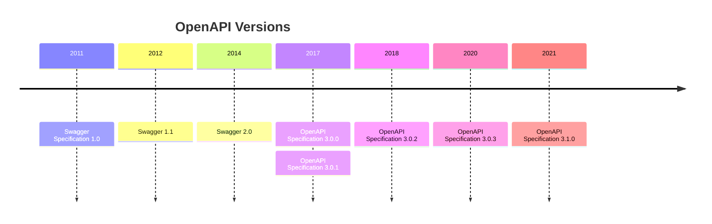

# Go ft Swagger (OpenAPI)


## OpenAPI

The OpenAPI Specification, previously known as the Swagger Specification, 
is a specification for a machine-readable interface definition language for 
describing, producing, consuming and visualizing web services.

The easiest way to understand the difference is:
- OpenAPI = Specification
- Swagger = Tools for implementing the specification



[Mermaid](https://mermaid.js.org/syntax/timeline.html) diagramming and charting tool.

Alternatives to Swagger:

- [Apidog](https://apidog.com/help/introduction/walk-through-apidog/)
- [RAML](https://raml.org/developers/raml-100-tutorial)
- [API Blueprint](https://apiblueprint.org/documentation/tutorial.html)

Go tools:

- [go-swagger](https://github.com/go-swagger/go-swagger)
- [swag](https://github.com/swaggo/swag)

At the time of creating this repository, both have ~1.1k forks and ~9.5k stars on GitHub.
It can be said that they are competitive; both are popular.

Let's see the differences between the two most popular Go Swagger tools.

Refer [article 01](https://github.com/go-swagger/go-swagger/issues/1794),
[article 02](https://github.com/swaggo/swag/issues/247).

## Setup

### Installing

```bash
go install github.com/go-swagger/go-swagger/cmd/swagger@latest
```
